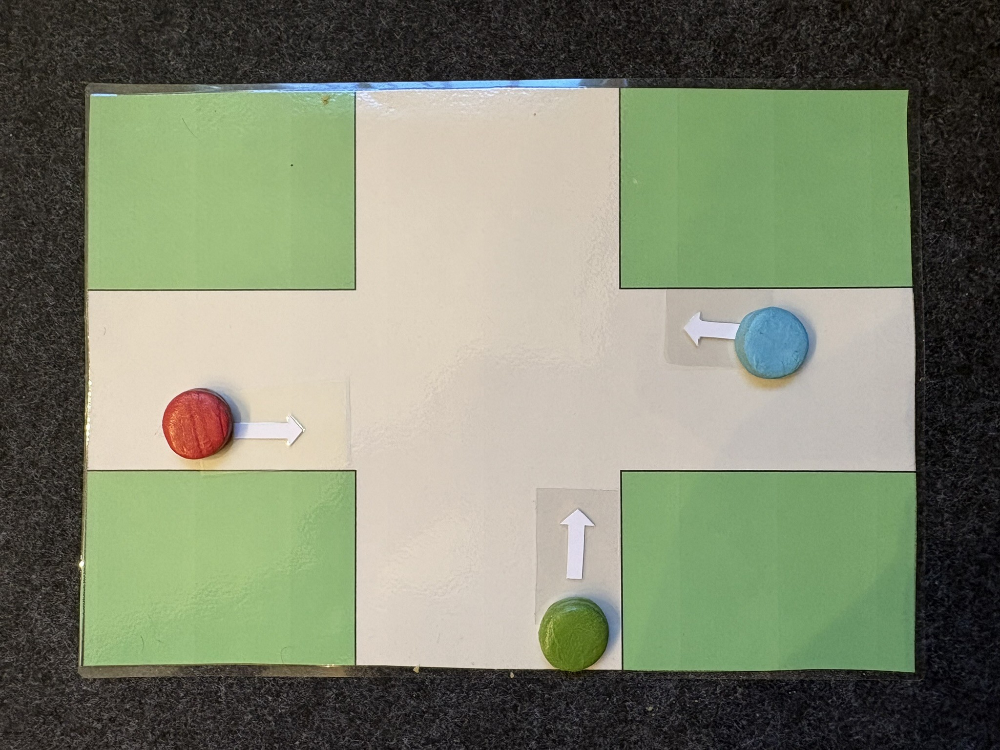
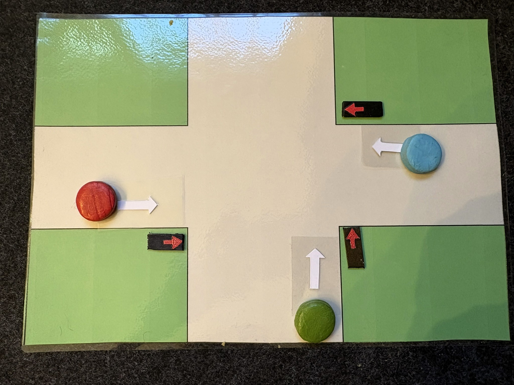
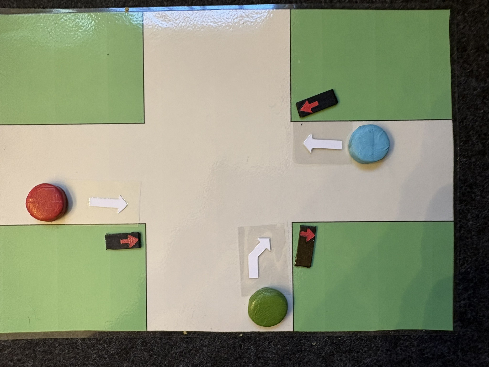

## Konfrontationsaufgabe 1 - Enaktiver Einstieg in das Thema
!!! task "KA1 - Situation 4 enaktiv nachspielen"
    ??? meta "Didaktische Begründung"
        Die Lernenden stellen mit einem physischen Kreuzungsmodell verschiedene Verkehrssituationen dar und entscheiden intuitiv, ob sie sicher oder unsicher sind. Bereits kleine Veränderungen führen zu kontroversen Einschätzungen - dadurch entsteht eine produktive Irritation. Diese dient als Ausgangspunkt für den Aufbau von Aussagenlogik, da deutlich wird, dass Sicherheit formal und eindeutig beschrieben werden muss.

    ??? teacher "Ziel der Aufgabe"
        Lernende werden körperlich-handlungsorientiert (enaktiv) an eine Verkehrssituation herangeführt.
        Sie sollen intuitiv entscheiden, wann eine Kreuzung sicher oder unsicher ist - ohne bereits logische Begriffe zu kennen.
        Das erzeugt Irritation ("Warum ist das jetzt unsicher?") und öffnet die Tür zur späteren formalen Modellierung.

    ???+ teacher "Material pro Gruppe (3-4 Personen)"
        Spielfläche: Ein mit Klebeband auf dem Tisch markiertes Kreuz = Kreuzung mit 4 Einfahrten (N, O, S, W) oder Vorlage
        Fahrzeuge: 3-4 Spielzeugautos pro Gruppe
        Pfeilkarten für eine Richtung (gerade, links, rechts)
        Signalkarten: Pro "Fahrspur" ein Set aus einer roten und einer grünen Ampelkarte (oder z.B. rote und grüne LEGO-Steine)
        Alternativ: Ausgedruckte Kreuzungsfelder und Papierautos.

    !!! logictraffic "Ablauf"
        ???+ teacher "Schritt 1 - Situation legen (enaktiv)"
            Die Lernenden legen mit den Autos selbst eine konkrete Verkehrssituation (im Beispiel Situation 4) auf die passende Kreuzung:
            { align=right width=200 }

            - Auto D (grün) fährt von Süden geradeaus
            - Auto E (rot) fährt von Westen geradeaus
            - Auto C (blau) fährt von Osten geradeaus

        ???+ teacher "Schritt 2 - Entscheidung treffen ohne Regeln zu erklären"
            Welche Ampeln werden benötigt, damit die Kreuzung sicher ist?
            !!! meta "Lösung"
                { align=right width=200 }
                in diesem Beispiel von Situation 4: dreimal geradeaus, weil die Autos alle geradeaus wollen.
                Die SuS bekommen dann entsprechende Ampeln.

            Aufgabe: Beschreibt mit Worten (evt. schriftlich) alle sicheren Zustände - schon jetzt fällt auf, dass das in geschriebenen sprachlichen Sätzen ziemlich aufwendig ist, selbst wenn es "nur" vier sichere Zustände gibt.
            Die Lernenden dürfen sich bewegen, Autos umstellen, „drüberfahren“ etc.
            Wichtig: Keine logischen Begriffe verwenden, Keine Fachregeln erklären, Nur intuitives Entscheiden zulassen. Ausserdem muss darauf geachtet werden, dass nur die gelegte Situation betrachtet wird. Also dass kein Auto abbiegen will etc.

        ???+ teacher "Schritt 3 - Irritation auslösen"
            Du veränderst nur ein einziges Auto: das grüne Auto fährt statt geradeaus nun rechts. "Ist es jetzt immer noch sicher? Was hat sich verändert?"
            { align=right width=200 }

            Die Lernenden bemerken:
            * Schon kleine Änderungen machen die Situation plötzlich gefährlich. -> eine andere Ampel wird benötigt.

            Das ist der didaktische Kern der Konfrontationsaufgabe: Die Lernenden spüren ein Problem, das später mit Aussagenlogik formal gelöst werden soll.

        ??? teacher "Vertiefung mit Reflexionsfragen"
            Diese Fragen öffnen das Thema für die nächsten Schritte (Erarbeitungsaufgaben), in denen Variablen, Wahrheitswerte und logische Operatoren eingeführt werden.

            - Welche Autos kommen sich in die Quere?
            - Kann man diese Situation allgemein beschreiben?
            - Was müsste man immer wissen, um Sicherheit zu beurteilen?
            - Reicht eure Intuition? Oder braucht es klare Regeln?
            - Weitere Karten mit entsprechenden Situationen legen, mündlich beschreiben lassen.

## Erarbeitungsaufgabe 1 „Wie beschreiben wir eine Kreuzung eindeutig? - Einführung in das Konzept Wahrheitstabelle“
Diese Erarbeitungsaufgabe eignet sich besonders auf Folgeaufgabe auf Konforntationsaufgabe 1.

!!! task "EA1 - Wie beschreiben wir eine Kreuzung eindeutig?"
    ???+ teacher "Ziel der Aufgabe"
        - Übergang von der enaktiven Arbeit mit dem Modell zur fachlichen Strukturierung
        - Einführung in Variablen als formale Beschreibungen von Verkehrssituationen
        - Aufbau eines ersten Verständnisses von Wahrheitswerten (0 = steht, 1 = fährt)
        - Vorbereitung auf logische Operatoren, Wahrheitstabellen und formale Sicherheitsregeln
        - Entwicklung einer gemeinsamen Sprache: "Wie beschreibt man eine Kreuzung logisch?"

    !!! logictraffic "Ausgangspunkt"
        Die Lernenden arbeiten zunächst mit GENAU der Verkehrssituation, die sie in der Konfrontationsaufgabe als unsicher oder verändert wahrgenommen haben. Die Lehrperson oder die SuS legen sie nochmals als Modell oder projizieren sie.

    === "Schritt 1 - Problemstellung"

        Lehrperson stellt folgende Problemstellung: "In der letzten Aufgabe habt ihr gemerkt, dass eine kleine Veränderung (Ampel wechselt auf grün) plötzlich alles unsicher macht. Wie können wir sicherstellen, dass wir keine gefährliche Situation übersehen? Notiert eure Ideen."

        Ziel: Die Lernenden formulieren das Bedürfnis nach vollständiger Übersicht.

    === "Schritt 2 - Erarbeitung des Konzeptes der Wahrheitstabelle"

        "Die Kreuzung hat drei Autos. Wie viele mögliche Rot-Gruen-Kombinationen gibt es? Notiert zuerst eure Vermutung, dann versucht es exakt auszuzählen."

        Ziel: Lernende entdecken selbst 2³ = 8 mögliche Zustände. Damit entsteht der natürliche Übergang: "Wir brauchen eine Tabelle, die alle Kombinationen auflistet." (Das ist die Wahrheitstabelle, aber der Begriff wird erst jetzt eingeführt.)

    === "Schritt 3: Wahrheitstabelle erstellen"

        Lehrperson gibt eine leere Tabelle ohne Überschrift (Begriffe kommen erst durch die Lernenden!)
        gemeinsam werden Beschriftungen der Überschriften erarbeitet. C, D, E (Ampelzustand für die Autos) & letzte Spalte (sicher / unsicher).

        ??? meta "binär"
            hier Verknüpfung zum Konzept von "binär" -> Also zwei Zustände: sicher / unsicher oder rot / grün.

Um das Erstellen von Wahrheitstabellen zu üben eignet sich nun das Online Tool LogicTraffic. Für die Einführung von diesem siehe: [LogicTrafficEinstieg](logictraffic.md). Für weitere Übungsaufgaben und Vertiefung zum Thema Wahrheitstabellen siehe: [Wahrheitstabellen](wahrheitstabellen.md).
