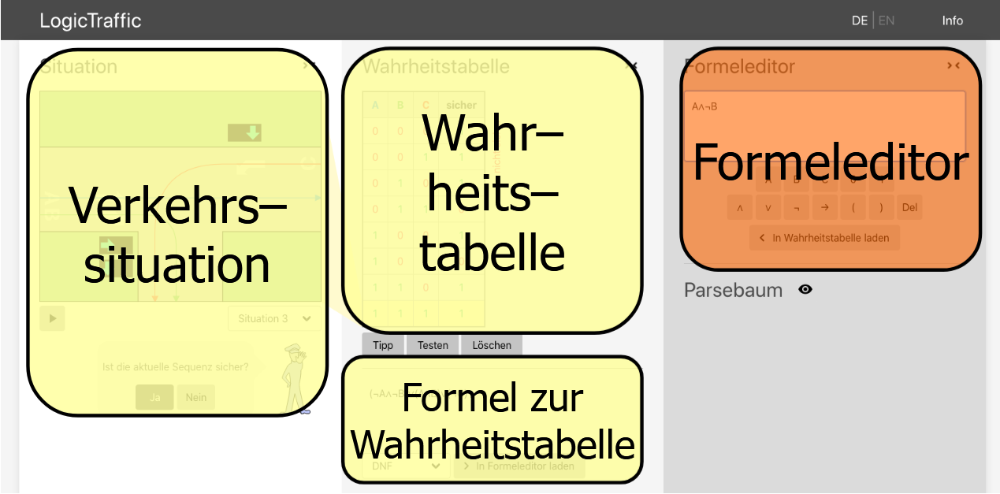

# Einführung in das Online Tool LogicTraffic

Die Grundidee der Online Lernumgebung LogicTraffic ist es, eine aussagelogische Formel zu finden, welche die vorgegebene Verkehrssituation sicher macht.

!!! logictraffic "Programmaufbau"
    
    In der graphischen Lernumgebung werden Verkehrssituationen an einer Kreuzung dargestellt. Dabei wird jede Fahrspur durch eine Variable (A, B, C...) identifiziert und jede Spur hat eine dazugehörige Ampel. Daneben werden in einer Wahrheitstabelle alle Spuren aufgelistet und es wird festgelegt, welche Konfigurationen sicher sind. Hier entspricht "0" (logisch falsch) einer roten Ampel, also "Fahrspur nicht frei" und entsprechend "1" (logisch wahr) einer grünen Ampel, also "Spur befahrbar". Eine Statusanzeige gibt an, ob die aktuelle Belegung der Tabelle (also die Einträge in der "sicher"-Spalte) nicht sicher, nicht optimal oder optimal ist. Ebenfalls wird zur aktuellen Belegung der Tabelle eine aussagenlogische Formel in gewünschter Form angegeben. Im Weiteren steht ein Formeleditor zur Verfügung, in welchem direkt Formeln erstellt und editiert werden können.

## Konfrontationsaufgaben

### Konfrontationsaufgabe 1

!!! task "KA1 - Einführung LogicTraffic"
    ??? teacher "Hinweis"
        Diese Konfrontationsaufgabe kann auch weggelassen werden, falls zuvor der Einstieg ins Thema enaktiv durchgeführt wurde [Einstieg](einstiegenaktiv.md). Allerdings bietet sie auch eine gute Wiederholung der sprachlichen Beschreibung von Situationen.

    !!! logictraffic "Ausgangspunkt"
        Die Lehrperson zeigt ein Foto/kurzes Video einer stark befahrenen Kreuzung mit Ampeln (Beamer/Arbeitsblatt) [Beispiele](../pdfmaterial/LogicTraffic%20-%20Einführung%20Konfrontationsaufgabe%201%20Mögliche%20Bilder%20von%20Kreuzungen%20und%20Verkehrssituationen.pdf).

        Falls die Aufgabe schriftlich bearbeitet werden soll: [KA1_LogicTraffic](../pdfmaterial/Kreuzungen%20beobachten%20und%20beschreiben.pdf)

    !!! student "Auftrag an die Lernenden, 5-10 Minuten"
        Beschreibe, was an dieser Kreuzung alles gleichzeitig passieren muss, damit niemand verunfallt.
        Formuliere mindestens drei "Wenn-dann"-Sätze zur Kreuzung, z.B.:

        - Wenn die Ampel grün ist, dann ...
        - Wenn ein Auto von da kommt, dann ...

        Überlege:

        - Wer oder was "entscheidet", wann welches Licht leuchtet?
        - Glaubst du, dass dahinter ein Programm steckt? Begründe.

### Konfrontationsaufgabe 2

!!! task "KA2 - Die Schaltzentrale"
    ??? teacher "Ziel der Aufgabe"
        Die Lernenden formulieren erste Steuerungsregeln für eine Kreuzung und erkennen, dass dafür klare, widerspruchsfreie Bedingungen nötig sind.

    !!! logictraffic "Ausgangspunkt"
        Tafelbild mit der Leitfrage: "Stell dir vor, du bist die Schaltzentrale dieser Kreuzung. Wie würdest du die Ampeln so steuern, dass es nie zu Unfällen kommt?" Als Material kann man die Bilder von [KA1](#konfrontationsaufgabe-1) verwenden.

    !!! student "Auftrag - Einzel- oder Gruppenarbeit, 5-10 Minuten"
        1. Skizziere auf einem Blatt grob eine Kreuzung (nur mit Strichen/Pfeilen).
        2. Schreibe dazu, wann welche Ampel "Grün" oder "Rot" sein soll. Nutze wieder Wenn-dann-Sätze.
        3. Tauscht euch kurz mit einer anderen Person aus: Finden sich Widersprüche? Gibt es Situationen, die ihr noch nicht geregelt habt?

    !!! teacher "Anschlussfrage im Plenum"
        "Wie könnten wir so etwas mit einem Computer programmieren, ohne eine Programmiersprache lernen zu müssen?"

    !!! teacher "Übergang zu Erarbeitungsaufgaben"
        Die Lehrperson präsentiert kurz die Startseite von https://logictraffic.ch und lässt sie kurz von Schüler:innen beschreiben:

        - Wofür könnte das gut sein?
        - Was könnte man damit machen?

## Erarbeitungsaufgabe - Finde die Bausteine

!!! task "EA1 - Bedienung und Grundkonzept des Tools aufbauen"
    ??? teacher "Ziel der Aufgabe"
        Hier geht es um das Erarbeiten der "Sprache" von logictraffic.ch: Oberflächen, Bausteine, Simulation.

        Die Lernenden lernen die Oberfläche kennen, klären Bedeutungen der Darstellungen und gewinnen eine erste Einsicht in den Zusammenhang Ampelsituation ↔ Wahrheitstabelle ↔ Formel.

    ???+ meta "Als PDF"
        [EA1_LogicTraffic](../pdfmaterial/Einführung%20LogicTraffic.pdf)

    !!! logictraffic "Ablauf"
        ??? student "Schritt 1 - Starte das Tool"
            * Öffne [Logictraffic](https://logictraffic.ch).
            * Wähle eine einfache vorgegebene Verkehrssituation (z.B. Situation 2).
            * Notiere: In welchem Bereich kannst du etwas eingeben?
            * Notiere: In welchem Bereich wird etwas ausgegeben?

        ??? student "Schritt 2 - Beschrifte die Oberfläche"
            Mache einen Screenshot oder zeichne eine Skizze der Oberfläche.
            Beschrifte mindestens:

            * Situation auf der Kreuzung
            * Wahrheitstabelle
            * Statusanzeige
            * Polizei, die Rückmeldung gibt
            * Simulation starten
            * Formeleditor

            ??? teacher "Lösung"
                Die Lösung könnte etwa so aussehen:
                { width = 400 }

        ??? student "Schritt 3 - Ampel und Wahrheitswerte zuordnen"
            Klicke in der Verkehrssituation auf eine Ampel einer Spur (z.B. A), bis sie grün ist.

            Beobachte die Wahrheitstabelle:

            * Welche Zeile wird als "aktuell" markiert?
            * Welcher Wert steht in der Spalte A? 0 oder 1?

            Notiere auf dem Arbeitsblatt:

            * Grün hat in der Wahrheitstabelle den Wert: .....
            * Rot hat in der Wahrheitstabelle den Wert: .....

        ??? student "Schritt 4 - Mit der Wahrheitstabelle spielen"
            Klicke in der "sicher"-Spalte einer Zeile einmal auf das Feld. Was ändert sich (0 -> 1 oder 1 -> 0)? Verändert sich die Statusanzeige ("nicht sicher", "sicher, nicht optimal", "optimal")?

            Notiere ein Beispiel: "Wenn ich die Zeile mit A=1, B=0 von nicht sicher auf sicher setze (0 -> 1), wird die Statusanzeige ..."

        ??? student "Schritt 5 - Beziehung zur Formel beobachten"
            !!! meta "Falls die Formeln evt. noch nicht eingeführt wurden, kann diese Aufgabe auch bis dahin ausgelassen werden."

            Schau dir rechts die Formel an (z.B. in Form "DNF"). Klicke bei Formelform nacheinander auf DNF, KNF, Einfachste.

            Notiere:

            * "Die Formel ändert sich, wenn ich ..."
            * "Eine Zeile mit 'sicher = 1' taucht in der DNF als ... auf."

## Übungsaufgabe - Von der Kreuzung zur Tabelle und zurück

!!! task "ÜA1 - Von der Kreuzung zur Tabelle und zurück"
    !!! teacher "Ziel der Aufgabe"
        Erarbeiten, dass die Wahrheitstabelle explizit festlegt, welche Ampelkombinationen "sicher" sind, und dass die Formel genau diese sicheren Zeilen beschreibt.

    ???+ meta "Material"
        Die Notizen können sich die Lernenden in ihr Heft oder auf ein Papier machen. Alternativ steht ein Arbeitsblatt zur Verfügung: [ÜA1_Logictraffic](../pdfmaterial/Von%20der%20Kreuzung%20zur%20Tabelle%20und%20zurück.pdf)

    !!! logictraffic "Ablauf"
        ??? student "Schritt 1 - Wähle eine einfache Situation"
            Wähle in LogicTraffic eine Situation mit zwei Fahrzeugen (z.B. A und B).

        ??? student "Schritt 2 - Ampelstellungen ausprobieren"
            Stelle im Kreuzungsbild folgende Situationen ein (klicke auf die Ampeln):

            1. A grün, B rot
            2. A rot, B grün
            3. A grün, B grün
            4. A rot, B rot

            Für jede der vier Situationen: Markiere in der Wahrheitstabelle die aktuelle Zeile (klick auf die Zeile). Schau, ob in dieser Zeile die Spalte "sicher" 0 oder 1 zeigt.

        ??? student "Schritt 3 - Wir formulieren eine allgemeingültige Regel"
            Formuliert in eigenen Worten eine Sicherheitsregel für diese Kreuzung, z.B.: "Es ist nur dann sicher, wenn ..."

            Versucht, die Regel auch als Wenn-dann-Satz aufzuschreiben.

            !!! teacher "Besprechung im Plenum"
                Dieser Wechsel von der enaktiven Simulation zur symbolischen Ebene ist anspruchsvoll und braucht eine Besprechung.

        ??? student "Schritt 4 - Vergleich mit Formel in LogicTraffic"
            !!! meta "Falls das Thema noch nicht eingeführt wurde, kann dieser Schritt auch später wiederholt oder nachgeholt werden."

            Wechselt rechts im Formelbereich auf "Einfachste".
            Kopiert die Formel auf das Arbeitsblatt (z.B. !A & B | A & !B o.ä.).

            Diskutiert:
            Wie passt diese Formel zu eurer verbalen Regel? Welche Teile der Formel entsprechen "A grün, B rot ist sicher", usw.?

## Übungsaufgabe - Umgang mit Logic Traffic festigen - Tool Führerschein

!!! task "ÜA2 - Tool Führerschein"
    !!! teacher "Ziele der Übung"
        Routine im Umgang mit Ampel-Anklicken, "sicher"-Spalte, Statusanzeige, Formelform.
        Alltagssicherheit bei der Interpretation von 0/1, sicher/unsicher.
        Automatisierung der grundlegenden Interaktionen, Sicherheit im Lesen/Deuten der Statusanzeige, ohne bereits tief in Normalformen einzusteigen.

    !!! teacher "Formative Beurteilungsaufgabe"
        Diese Aufgabe kann auch als formative Beurteilungsaufgabe dienen. Wichtig ist dann, dass sich die Lehrperson vom Lernenden zeigen lässt, dass er oder sie die entsprechenden Fähigkeiten auch kann.
        Dies kann auch durch Partnerarbeit geschehen.

    !!! logictraffic "Auftrag"
        Die Checkliste für den Führerschein sowie eine Vorlage für einen solchen "Führerschein" finden sich hier:

        ??? student "LogicTraffic Führerschein"
            Arbeite in deinem eigenen Tempo. Hake ab, was du sicher kannst. Wenn du Hilfe brauchst, markiere die Aufgabe mit einem Fragezeichen.

            [ ] Situation wählen

            * Ich kann eine vorgegebene Verkehrssituation auswählen.

            [ ] Ampeln verändern und aktuelle Zeile finden

            * Ich kann Ampeln anklicken und so eine bestimmte Ampelkombination einstellen.
            * Ich finde in der Wahrheitstabelle die Zeile, die zu dieser Ampelkombination gehört (aktuelle Zeile markieren).

            [ ] "sicher"-Spalte bearbeiten

            * Ich kann in der Spalte "sicher" durch Klicken 0 und 1 ändern.
            * Ich sehe, dass sich dadurch die Statusanzeige (z.B. "nicht sicher", "sicher, nicht optimal", "optimal") verändert.

            [ ] Statusanzeige deuten

            * Ich kann in eigenen Worten erklären:
                - "nicht sicher" bedeutet ...
                - "sicher, nicht optimal" bedeutet ...
                - "optimal" bedeutet ...

            [ ] Formelansicht wechseln

            * Ich kann im Bereich "Formeln" zwischen verschiedenen Formeln umschalten (DNF, KNF, Einfachste).
            * Ich sehe, dass sich die Formel ändert, obwohl die Verkehrssituation gleich bleibt, wenn ich umschalte.

## Syntheseaufgabe

!!! task "SA1 - LogicTraffic in einer Gesamtaufgabe anwenden"
    !!! teacher "Ziel der Aufgabe"
        Fokus: mehrere zuvor erarbeitete Teilkompetenzen in einer komplexeren Anforderungssituation anwenden.
        Lernende zeigen, dass sie:

        * die Oberfläche bedienen,
        * "sicher / optimal" fachlich interpretieren,
        * die Wahrheitstabelle so bearbeiten, dass sie zur optimalen Sicherheitsregel wird,
        * die resultierende Formel als Gesamtmodell verstehen.

    !!! danger "Voraussetzungen"
        Bei dieser Aufgabe müssen die Grundlagen des Themas Wahrheitstabellen und für den Schritt 3 auch die der Formeln verstanden sein.

    !!! logictraffic "Ablauf"
        ??? student "Schritt 1 - Situation auswählen"
            Wähle in LogicTraffic eine Verkehrssituation mit 3 Autos aus.
            Beschreibe kurz in eigenen Worten, wie die Spuren der Autos verlaufen (z.B. "A und B kreuzen sich, C läuft geradeaus").

        ??? student "Schritt 2 - Analyse der aktuellen Situation"
            Fülle zuerst hier auf dem Arbeitsblatt oder in dein Heft die Wahrheitstabelle für alle Spuren aus.
            Überprüfe deine Lösung indem du sie in das Tool eingibst. Am Schluss soll die Statusanzeige "optimal" anzeigen.

        ??? student "Schritt 3 - Formel als Gesamtmodell verstehen"
            Schalte rechts auf die Formeldarstellung "Einfachste". Schreibe die Formel ab.

            Erkläre in 2-3 Sätzen: "Diese Formel beschreibt meine fertige, optimale Sicherheitsregel, weil ..." (z.B.: Sie ist genau dann wahr, wenn ...).
